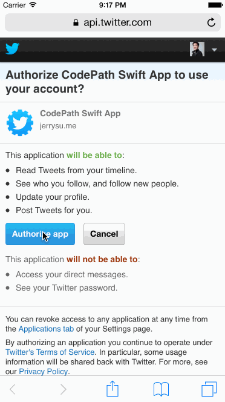

## CodePath Week 3: Twitter Client

This is a simple Twitter client written in Swift that uses Twitter's [REST APIs](https://dev.twitter.com/rest/public).

**Time spent**: Approximately 8 hours

I didn't have much free time this past week to work on this assignment. I do feel, however, after implementing the [Yelp App](https://github.com/jerrysu/CodePath-Yelp), that I've got the hang of Auto Layout and storyboarding. The work done on this project seemed straightforward to me and it was much easier to make fast progress.

### Walkthrough



### Requirements

All required specs were implemented. Some optional specs were implemented.

  * [x] User can sign in using OAuth login flow
  * [x] User can view last 20 tweets from their home timeline
  * [x] The current signed in user will be persisted across restarts
  * [x] In the home timeline, user can view tweet with the user profile picture, username, tweet text, and timestamp. In other words, design the custom cell with the proper Auto Layout settings. You will also need to augment the model classes.
  * [x] User can pull to refresh
  * [x] User can compose a new tweet by tapping on a compose button.
  * [x] User can tap on a tweet to view it, with controls to retweet, favorite, and reply.
  * [x] Optional: When composing, you should have a countdown in the upper right for the tweet limit.
  * [x] Optional: After creating a new tweet, a user should be able to view it in the timeline immediately without refetching the timeline from the network.
  * [ ] Optional: Retweeting and favoriting should increment the retweet and favorite count.
  * [ ] Optional: User should be able to unretweet and unfavorite and should decrement the retweet and favorite count.
  * [ ] Optional: Replies should be prefixed with the username and the reply_id should be set when posting the tweet,
  * [ ] Optional: User can load more tweets once they reach the bottom of the feed using infinite loading similar to the actual Twitter client.

### Installation

Run the following in command-line:

```
pod install
open Twitter.xcworkspace
```

In XCode 6, run the app using the `iPhone 5S` or `iPhone 6` simulators.

### Resources

The following CocoaPods were used:

  * [AFNetworking](https://github.com/AFNetworking/AFNetworking)
  * [BDBOAuth1Manager](https://github.com/bdbergeron/BDBOAuth1Manager)
  * [MBProgressHUD](https://github.com/jdg/MBProgressHUD)
  * [NSDate-MinimalTimeAgo](https://github.com/joshdholtz/NSDate-MinimalTimeAgo/)
  * [SVPullToRefresh](https://github.com/samvermette/SVPullToRefresh)

### License

> The MIT License (MIT)
>
> Copyright © 2014 Jerry Su, http://jerrysu.me
>
> Permission is hereby granted, free of charge, to any person obtaining a copy of
> this software and associated documentation files (the “Software”), to deal in
> the Software without restriction, including without limitation the rights to
> use, copy, modify, merge, publish, distribute, sublicense, and/or sell copies of
> the Software, and to permit persons to whom the Software is furnished to do so,
> subject to the following conditions:
>
> The above copyright notice and this permission notice shall be included in all
> copies or substantial portions of the Software.
>
> THE SOFTWARE IS PROVIDED “AS IS”, WITHOUT WARRANTY OF ANY KIND, EXPRESS OR
> IMPLIED, INCLUDING BUT NOT LIMITED TO THE WARRANTIES OF MERCHANTABILITY, FITNESS
> FOR A PARTICULAR PURPOSE AND NONINFRINGEMENT. IN NO EVENT SHALL THE AUTHORS OR
> COPYRIGHT HOLDERS BE LIABLE FOR ANY CLAIM, DAMAGES OR OTHER LIABILITY, WHETHER
> IN AN ACTION OF CONTRACT, TORT OR OTHERWISE, ARISING FROM, OUT OF OR IN
> CONNECTION WITH THE SOFTWARE OR THE USE OR OTHER DEALINGS IN THE SOFTWARE.
